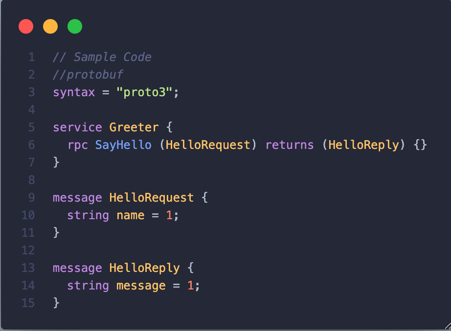

# Title
Microservices with Spring Boot gRPC

## Context
Q: What is the issue that we're seeing that is motivating this decision or change?

A: **We are developing a new microservices-based application where efficient inter-service communication is crucial. We need to decide on a technology for handling this communication.**

A: **Issue is about when our project or product become more bigger it'd be hard to implement on monolith architecture, So this's such a big problem for scale the application**

## Decision
Q: What is the solution that we're proposing and/or doing?

A: **Adopt gRPC as the primary communication protocol between microservices.**

A: **Use Protocol Buffers (protobuf) for service definition and serialization.**

## Rationale
Q: Why do we choose this solution?

**A: We choose this solution for several reasons:**
- **Efficiency:** gRPC offers high-performance, bidirectional streaming, and supports multiple programming languages.
- **Interoperability:** Protocol Buffers provide language-agnostic service definitions, enabling seamless communication between services.
- **Scalability:** gRPC's support for HTTP/2 allows for multiplexing, reducing latency and improving scalability.
- **Tooling:** gRPC provides robust tooling for generating client and server code, simplifying development.

## Consequences
Q: Pros – What becomes easier?

### Pros
- Efficient communication between microservices.
- Language-agnostic service definitions improve interoperability.
- Support for bidirectional streaming and HTTP/2 enhances scalability.
- Simplified development with robust tooling.

Q: Cons – What becomes more difficult?

### Cons
- Initial learning curve for developers new to gRPC and Protocol Buffers.
- Increased complexity in managing service contracts and versions.

## Sample code
Give some sample code related to this decision.

